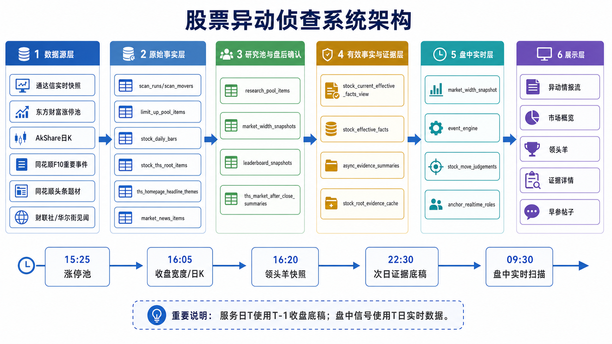

# 股票异动侦查系统架构

架构图：

## 核心目标

本项目的本质是：围绕个股异动，快速定位异动原因，筛出真正有效证据，并在盘中以足够快的速度展示出来。

系统按职责拆成六层：

```text
数据源层 -> 原始事实层 -> 研究池与盘后确认 -> 有效事实与证据层 -> 盘中实时层 -> 展示层
```

## 日期契约

所有页面和任务必须区分三类日期：

| 字段 | 含义 |
| --- | --- |
| `service_trade_date` | 页面服务的交易日 |
| `base_trade_date` | 证据底稿基准日，通常是上一交易日收盘 |
| `leader_data_trade_date` | 领头羊实际计算日 |

规则：

```text
服务日 T 使用 T-1 收盘底稿。
异动情报流和市场概览盘中使用 T 日实时数据。
领头羊盘中读取最近收盘确认快照，盘后 16:20 生成 T 日确认快照。
```

## 数据源层

| 数据源 | 用途 |
| --- | --- |
| 通达信实时快照 | 盘中涨速、成交额、市场宽度、窗口强度 |
| 东方财富涨停池 | 涨停确认、连板天数、领头羊封板维度 |
| AkShare 日K | 日涨跌幅、5日涨幅、收盘宽度 |
| 同花顺 F10 重要事件 | 有效事实候选 |
| 同花顺首页头条题材 | 多题材关联、题材内角色 |
| 财联社/华尔街见闻 | 早参消息和盘前主题 |

## 原始事实层

原始事实层只负责采集和落库，不负责判断。

| 表 | 含义 |
| --- | --- |
| `scan_runs` / `scan_movers` | 盘中实时扫描结果 |
| `limit_up_pool_items` | 东方财富涨停池 |
| `stock_daily_bars` | A股日K |
| `stock_ths_root_items` | F10 近期重要事件 |
| `ths_homepage_headline_themes` | 首页头条题材 |
| `market_news_items` | 盘前新闻 |

## 研究池与盘后确认

研究池是全项目的增量边界。

当前研究池规则：

```text
近5日涨停股票
+
近5日无涨停且5日涨幅排名 Top30
```

| 表 | 用途 |
| --- | --- |
| `research_pool_items` | 服务日研究池成分 |
| `market_width_snapshots` | 市场宽度快照 |
| `leaderboard_snapshots` | 收盘确认版领头羊快照 |
| `ths_market_after_close_summaries` | 盘后市场小结 |

`leaderboard_snapshots` 生成前必须校验：

```text
limit_up_pool_items 已更新
stock_daily_bars 已更新
market_width_snapshots 已有收盘快照
```

## 有效事实与证据层

有效事实层只做“事实是否对当前异动仍然有用”的筛选和摘要。

| 表/视图 | 用途 |
| --- | --- |
| `stock_current_effective_facts_view` | 近10日有效事实候选 |
| `stock_effective_facts` | 有效事实落库 |
| `async_evidence_summaries` | 有效事实总结 |
| `stock_root_evidence_cache` | Web 证据详情缓存 |

当前原则：

```text
没有有效事实，不调用模型。
龙虎榜只有同花顺详情中的蓝色席位标签才进入有效事实。
展示层优先读取根证据缓存，不现场拼复杂证据。
```

## 盘中实时层

盘中任务只在交易日交易时间运行。

| 任务 | 用途 |
| --- | --- |
| `market_width_snapshot` | 市场概览实时快照 |
| `event_engine` | 盘中事件信号 |
| `stock_move_judgements` | 异动情报流判断 |
| `anchor_realtime_roles` | 题材内领涨和中军角色 |

## 展示层

| 页面 | 数据策略 |
| --- | --- |
| 异动情报流 | 服务日研究池 + 当日盘中实时信号 + 根证据缓存 |
| 市场概览 | 当日实时市场宽度，未开盘时回退最近交易日并标注 |
| 领头羊 | 优先读取收盘确认快照 |
| 证据详情 | 根证据缓存 + 有效事实总结 + 多题材角色 |
| 早参帖子 | 盘前消息、昨日市场背景、盘后题材归因 |

## 任务时间线

```text
15:25  eastmoney_limit_up_pool
16:05  market_width_daily_close
16:20  post_close_leaderboard_snapshot
22:30  pre_trade_night_evidence_prepare
09:30  盘中实时扫描开始
```

## 已退出主链路

- 问财 Top50 研究池
- 同花顺涨停复盘表
- 题材理由库 `stock_theme_reason_bank`
- 独立公告影响评分
- `stock_move_judgement_dirty_queue`

## 当前仍值得继续优化

- 领头羊大 SQL 后续可拆成维度分表。
- Web API 可以继续拆成 FastAPI router。
- 盘中热任务需要更细的耗时监控。
- 中文乱码文件仍需继续清理。
