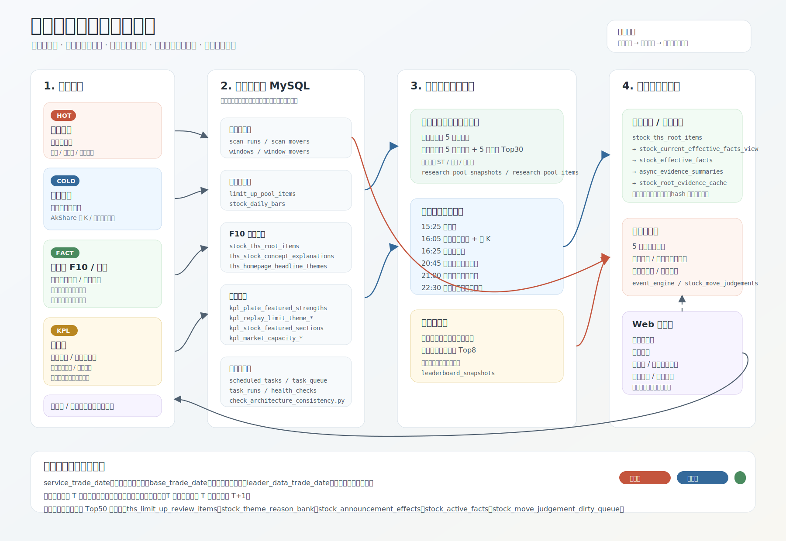

# 股票异动侦查系统架构

架构图：

## 核心目标

本项目的本质是：围绕个股异动，快速定位异动原因，筛出真正有效的证据，并用足够快的页面展示出来。

系统按职责拆成七层：

```text
数据源层
  -> 原始事实层
  -> 研究池层
  -> 盘后确认层
  -> 有效事实与证据层
  -> 盘中实时层
  -> 展示层
```

## 日期契约

| 字段 | 含义 |
| --- | --- |
| `service_trade_date` | 页面服务的交易日 |
| `base_trade_date` | 证据底稿基准日，通常是上一交易日收盘确认数据 |
| `leader_data_trade_date` | 领头羊实际计算日 |

规则：

- 异动情报流和市场概览盘中使用服务日 T 的实时数据。
- 领头羊盘中读取最近收盘确认快照。
- T 日收盘后生成 T 日领头羊快照，服务 T+1。
- 历史页面明确选择某个日期时，读取该日期自己的收盘确认快照。

## 数据源层

| 数据源 | 用途 |
| --- | --- |
| 通达信实时快照 | 盘中涨速、成交额、窗口强度、市场概览 |
| 东方财富涨停池 | 涨停确认、封板时间、连板天数、领头羊得分 |
| AkShare 日 K | 5 日涨幅、收盘宽度、日线补全 |
| 同花顺 F10 近期重要事件 | 有效事实候选 |
| 同花顺 F10 概念解释 | 题材解释、趋势票解释、同花顺领头羊题材关系 |
| 同花顺首页头条题材 | 同花顺领头羊的题材作用域，盘后冻结 |
| 开盘啦精选强度 | 开盘啦领头羊板块排序 |
| 开盘啦复盘啦涨停原因 | 涨停票主归因和情绪票说明 |
| 开盘啦个股精选板块 | 非涨停票主板块归属 |
| 开盘啦预测量能 | 市场概览的预测成交额 |
| 财联社/华尔街见闻/同花顺盘后小结 | 早参帖子和市场背景 |

## 原始事实层

原始事实层只负责采集和落库，不做复杂判断。

| 表 | 含义 |
| --- | --- |
| `scan_runs` / `scan_movers` | 盘中实时扫描结果 |
| `windows` / `window_movers` | 开盘至今窗口强度 |
| `limit_up_pool_items` | 东方财富涨停池 |
| `stock_daily_bars` | A 股日 K |
| `stock_ths_root_items` | F10 近期重要事件 |
| `ths_stock_concept_explanations` | 同花顺个股概念解释 |
| `ths_homepage_headline_themes` | 同花顺首页头条题材和冻结快照 |
| `kpl_plate_featured_strengths` | 开盘啦精选板块强度 |
| `kpl_replay_limit_theme_groups` / `kpl_replay_limit_theme_stocks` | 开盘啦复盘啦涨停原因分组 |
| `kpl_stock_featured_sections` | 个股所属开盘啦精选板块 |
| `kpl_stock_limit_up_reasons` | 个股开盘啦涨停原因 |
| `kpl_market_capacity_snapshots` / `kpl_market_capacity_trends` | 开盘啦预测量能 |

## 研究池层

研究池是全项目的增量边界。盘中扫描、F10 增量、开盘啦个股采集、领头羊候选都围绕研究池执行。

基础研究池规则：

```text
近 5 日有涨停股票
+
近 5 日无涨停且 5 日涨幅 Top30 股票
```

研究池有两个使用口径：

| 口径 | 参数 | 用途 |
| --- | --- | --- |
| 熊市系统 | `ma_mode=none` | 最全研究池，市场概览、异动情报、默认分析使用 |
| 牛市系统 | `ma_mode=ma5_10_20_30_up` | 在最全研究池基础上增加 MA5/10/20/30 各自前周期向上过滤，领头羊和板块爆发榜可切换使用 |

约束：

- 排除 ST、退市、北交所。
- 近 5 日有涨停定义为情绪票。
- 近 5 日无涨停且 5 日涨幅 Top30 定义为趋势票。

核心表：

| 表 | 用途 |
| --- | --- |
| `research_pool_snapshots` | 每个交易日研究池快照 |
| `research_pool_items` | 研究池成分，含情绪票/趋势票来源 |
| `research_pool_theme_members` | 研究池与同花顺概念关系，当前不是主实时任务 |

## 盘后确认层

盘后确认层负责生成第二天可直接读取的冷数据。

```text
15:25  东方财富涨停池
16:05  收盘市场概览和日 K
16:25  研究池
20:25  开盘啦板块爆发详情
20:35  同花顺领头羊快照
20:45  开盘啦领头羊快照
22:30  下一交易日证据底稿
```

`pre_trade_night_evidence_prepare` 不是单一步骤，而是证据底稿总 pipeline。内部会顺序执行 F10 增量、研究池题材关系、题材角色缓存、有效事实、模型/兜底总结和根证据缓存刷新。部分同名任务已经不再独立调度，但仍作为这个 pipeline 的内部步骤存在。

领头羊快照写入 `leaderboard_snapshots`：

- `source='ths_homepage_headline'`：同花顺领头羊。
- `source='kpl_primary_theme'`：开盘啦精选领头羊。

## 有效事实与证据层

有效事实层只回答一个问题：这条事实对当前异动是否还值得展示。

当前主链路：

```text
stock_ths_root_items
  -> stock_current_effective_facts_view
  -> stock_effective_facts
  -> async_evidence_summaries
  -> stock_root_evidence_cache
```

原则：

- 只从 F10 近期重要事件进入有效事实主链路。
- 主要取近 10 日仍有效的事实。
- 普通低价值信息直接过滤。
- 龙虎榜只有 F10 详情里带蓝色席位标签的记录才进入有效事实。
- 没有有效事实，不调用模型。
- 有效事实 hash 不变，复用已有总结。

## 盘中实时层

盘中热任务只在交易日交易时间运行。

| 任务 | 用途 |
| --- | --- |
| `realtime_mover_scan` | 研究池 5 秒扫描，分钟级任务循环执行 |
| `market_width_snapshot` | 市场概览实时快照，含开盘啦预测量能 |
| `kpl_plate_strength` | 开盘啦精选强度盘中刷新 |
| `auction_candidates` | 09:15-09:25 集合竞价封单候选和分钟雷达 |
| `anchor_realtime_roles` | 题材内实时领涨和中军角色 |
| `event_engine` | 标准化盘中异动事件 |
| `stock_move_judgements` | 异动情报流解释和持续性判断 |

## 展示层

| 页面 | 数据策略 |
| --- | --- |
| 异动情报流 | 服务日最全研究池 + 当日实时信号 + 根证据缓存 |
| 市场概览 | 当日实时市场宽度；全市场、成交额 Top50、最全研究池；非交易时段回退最近交易日 |
| 领头羊 | 同花顺首页题材冻结快照 + 研究池候选，支持牛市/熊市口径 |
| 开盘啦领头羊 | 开盘啦精选强度 Top8 + 研究池候选，支持牛市/熊市口径 |
| 板块爆发榜 | 开盘啦精选强度 Top5 + 爆发原因 + 子板块 + 研究池交集 Top |
| 竞价详情 | 09:15-09:25 封单稳定性、撤单、最终突入、尾盘掉榜 |
| 证据详情 | 根证据缓存 + 有效事实总结 + 多题材角色 |
| 早参帖子 | 盘前消息 + 昨日市场背景 + 盘后题材归因 |

## 已退出主链路

- 问财 Top50 研究池。
- 同花顺涨停复盘表 `ths_limit_up_review_items`。
- 题材理由库 `stock_theme_reason_bank`。
- 独立公告影响评分 `stock_announcement_effects`。
- 旧有效事实表 `stock_active_facts`。
- `stock_move_judgement_dirty_queue`。

## 当前技术债

- `stock_scout_web.py` 仍偏大，后续适合拆成 FastAPI router。
- 领头羊 SQL 仍偏重，后续可拆成维度分表，便于解释得分来源。
- 源码里仍有少量历史中文乱码，已不影响主流程，但长期需要清理。
- 盘中热任务的耗时监控还可以更细。
